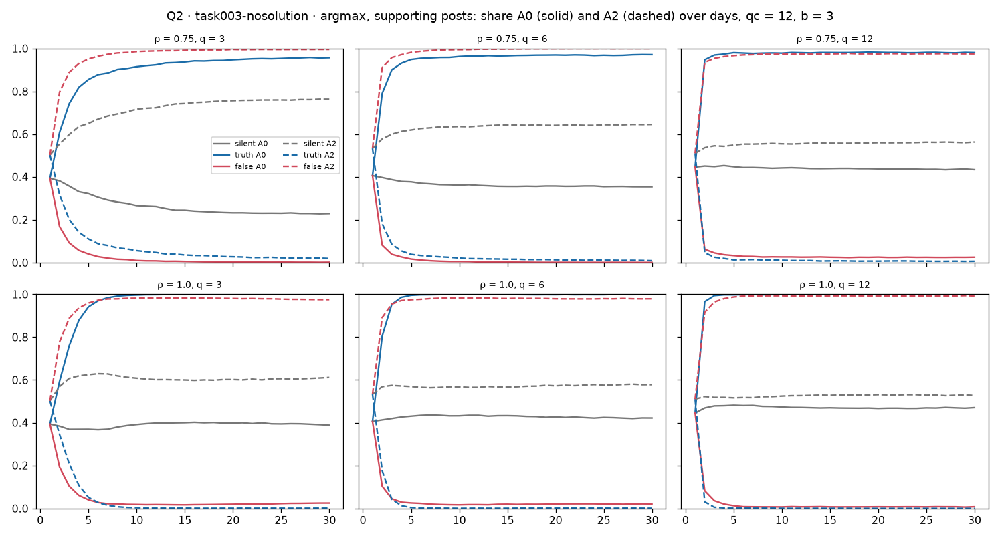
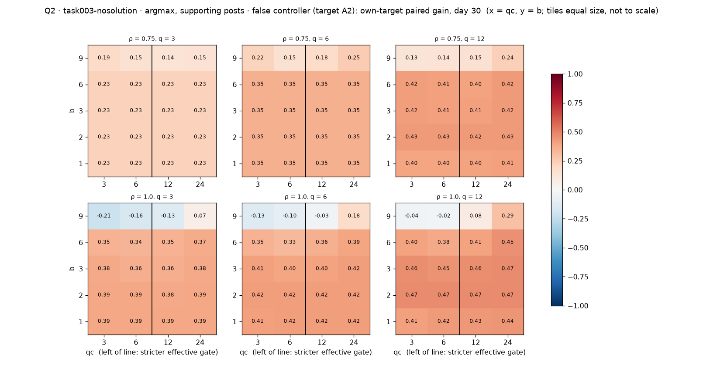
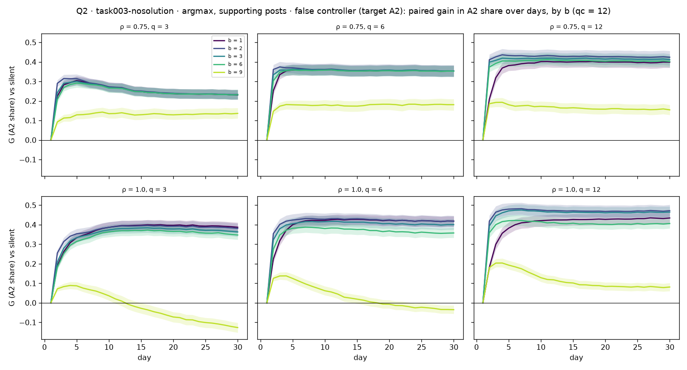
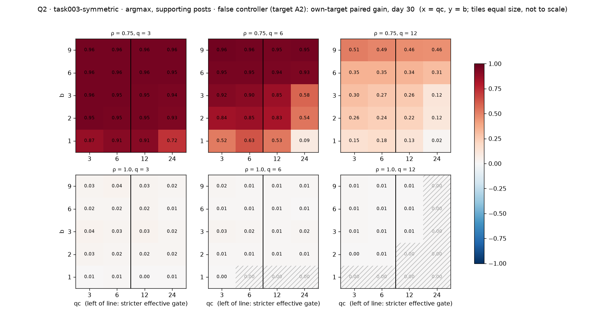

# Q2 — does control work, and how?

**7 October 2026.** Main runs of 7 October (stopping rule on), analysed as set out
in [`ANALYSIS_PLAN.md`](ANALYSIS_PLAN.md). Scripts: [`q2_compute.py`](q2_compute.py)
(tables; deterministic from run to run) and [`q2_figures.py`](q2_figures.py) (128
figures). Full outputs: `results/analysis/2026-10-07/` (`index.csv` lists them).
Curated figures are in [`figures/`](figures/); the day-30 table is
[`tables/q2_final.csv`](tables/q2_final.csv).

Every number is a **paired gain**: the controlled run minus the silent run of the
same episode, averaged over 1,000 episodes, with a 95% bootstrap interval. Numbers
quoted "over q" are averages over q = 3, 6, 12; the tables keep each q.

## Summary

1. **In task003-nosolution, either controller wins easily and fast.** Both lift
   their target's share by 0.2–0.7 over silence, and push it past 75% in about
   2–3 days in nearly every episode.
2. **Under argmax voting with supporting posts (base), control is extremely
   cheap: one posted fact moves 5–7 agents.** The controller only has to tip the
   lock-in found in Q1; the swarm does the rest. Under probability matching (no
   lock-in) the same controller moves 5–20 times fewer agents per fact.
3. **A larger budget can backfire, for a mechanical reason.** At b = 9 the false
   controller's gain collapses, and with full memory turns negative (it ends up
   *helping* the truth). The no-solution pool holds only 4–6 facts favouring A2, so
   posting 9 at once forces it to post counter-evidence; its A2 vote share then
   stays below the gate, so it keeps posting every night.
4. **In task003-symmetric, the false controller defeats a swarm that owns a proof
   only when agents forget.** At ρ = 0.75 the base false controller pushes A2 past
   75% in 76% of episodes; at ρ = 1 in 15%. With full memory any early A2 gain is
   temporary: under uniform posting the A2 share reaches about 0.6 by day 2–3, then
   falls to 0.02 by day 30 as the proof reassembles. *(Corrected 7 October: an
   earlier version read this as uniform posting "still succeeding in 59% of
   episodes"; those episodes passed 75% only transiently.)*
5. **The truth has a directional edge everywhere** (D for A0 > 0). Averaged over
   the two targets, control helps the truth in task003-nosolution (M for A0 > 0)
   and hurts it in task003-symmetric (M < 0), where the truth controller has no
   room left to add anything.
6. **qc matters little**, except that at b = 9 a larger qc softens the backfire.

---

## 1. task003-nosolution: control works, fast

Own-target gain at day 30, qc = 12, b = 3 (from [`tables/q2_final.csv`](tables/q2_final.csv)):

| ρ | arm | base (q = 3 / 6 / 12) | prob. matching | uniform posts |
|---|---|---|---|---|
| 0.75 | false (A2) | 0.23 / 0.35 / 0.41 | 0.21 / 0.25 / 0.23 | 0.42 / 0.40 / 0.39 |
| 0.75 | truth (A0) | 0.73 / 0.62 / 0.55 | 0.33 / 0.42 / 0.43 | 0.45 / 0.48 / 0.49 |
| 1.0 | false (A2) | 0.36 / 0.40 / 0.46 | 0.08 / 0.07 / 0.06 | 0.35 / 0.35 / 0.38 |
| 1.0 | truth (A0) | 0.61 / 0.58 / 0.53 | 0.37 / 0.37 / 0.38 | 0.37 / 0.40 / 0.42 |

Speed and lock-in (qc = 12, b = 3, averaged over q):

| ρ | arm | variant | target past 75% by day 30 (silent) | median day | all 24 on target, day 30 (silent) |
|---|---|---|---|---|---|
| 0.75 | false | base | 1.00 (0.67) | 2 | 0.95 (0.62) |
| 0.75 | truth | base | 1.00 (0.42) | 2–3 | 0.62 (0.26) |
| 1.0 | false | base | 0.99 (0.58) | 2 | 0.96 (0.46) |
| 1.0 | truth | base | 1.00 (0.47) | 2–3 | 1.00 (0.30) |
| 1.0 | false | prob. matching | 0.90 (0.47) | 3 | 0.00 (0.00) |

The silent column matters: in the base variant the silent swarm already reaches
75% A2 in about two thirds of episodes, so the false controller's raw success
overstates its effect. The gain column measures the effect.

## 2. Efficiency: lock-in makes control cheap

Extra supporting agents per fact actually posted (24 × gain ÷ facts posted), qc = 12,
averaged over q:

| setup | ρ | arm | variant | b = 1 | b = 3 | b = 9 |
|---|---|---|---|---|---|---|
| nosolution | 0.75 | false | base | **5.7** | 2.5 | 0.05 |
| nosolution | 0.75 | false | prob. matching | 0.65 | 0.16 | −0.01 |
| nosolution | 0.75 | truth | base | **6.8** | 3.8 | 0.90 |
| nosolution | 1.0 | truth | uniform posts | 5.4 | 2.5 | 0.59 |
| symmetric | 0.75 | false | base | 0.91 | 0.72 | 0.38 |

Efficiency falls with b everywhere: the first facts do almost all the work. Under
the base rule the gain is nearly the same for b = 1 to 6 (it is set in the first
nights), while the dose grows.

## 3. The b = 9 backfire

Gain is flat for b = 1–6, then drops at b = 9. With full memory (bottom row) it
turns negative for qc ≤ 12: the false controller ends up pushing the swarm toward
the truth.

**Mechanism, checked in the posted facts** (nosolution, false, q = 6, qc = 12, ρ = 1):

| variant | b | nights the controller posts | posted facts favouring A0 / A1 / A2 | mean v̂ |
|---|---|---|---|---|
| base | 3 | 6% | 13% / 19% / 68% | 0.96 |
| base | 6 | 12% | 12% / 22% / 66% | 0.92 |
| base | 9 | **45%** | **26%** / 23% / 51% | 0.60 |
| prob. matching | 9 | **93%** | **26%** / 23% / 51% | 0.37 |

The pool favours A0 / A1 / A2 with 4 / 5 / 6 facts (tied facts counted for both
sides). A set of 9 must include counter-evidence; the A2 vote share then stays
below the gate, so the controller keeps posting, and the counter-evidence piles up
in memory. Over time the gain decays and, with full memory, crosses zero around
days 13–18:

A larger qc softens this (at ρ = 1, q = 3: −0.21 at qc = 3 against +0.07 at
qc = 24).

**This is a property of the design, not of the agents.** The controller must post
all b facts or none, and the shared pool has only a few facts per target. In
task003-symmetric, where each pool is entirely on its target's side, the false
controller's gain keeps rising with b (0.52 → 0.79 at ρ = 0.75, base).

## 4. task003-symmetric: proof versus forgetting

- **Forgetting decides.** At ρ = 0.75 the base false controller gains 0.95 / 0.85 /
  0.26 for q = 3 / 6 / 12 (qc = 12, b = 3): reading more defends the proof. At
  ρ = 1 it gains at most 0.03.
- **With full memory, the false controller's success is temporary.** Under uniform
  posting the mean A2 share rises to 0.58–0.61 by days 2–3, then falls to 0.02 by
  day 30 (base: 0.27, then 0.05). Many episodes pass 75% A2 early (59% under uniform
  posting), but the proof reassembles as memories fill. *(Corrected 7 October: an
  earlier version presented the 59% as lasting success.)*
- **With forgetting, uniform posting makes the swarm more vulnerable.** At ρ = 0.75
  the false controller's gain does not fall with q (0.67–0.72), unlike under
  supporting posts, where reading more defends the proof: agents holding the proof
  keep circulating it.
- **The truth controller has nothing to add** (gain ≤ 0.07): the silent swarm
  already reaches A0.

## 5. Shared and directional parts (A0), qc = 12, b = 3, averaged over q

| setup | ρ | variant | D (directional) | M (shared) |
|---|---|---|---|---|
| nosolution | 0.75 | base | 0.48 | 0.15 |
| nosolution | 0.75 | prob. matching | 0.29 | 0.11 |
| nosolution | 1.0 | base | 0.49 | 0.08 |
| symmetric | 0.75 | base | 0.36 | −0.33 |
| symmetric | 0.75 | uniform posts | 0.43 | −0.25 |
| symmetric | 1.0 | base | 0.03 | 0.01 |

D > 0 everywhere: which target is requested matters, in the requested direction.
In task003-nosolution M for A0 is positive: averaged over the two targets, control
helps the truth, consistent with the truth's higher ceiling (0.92 against 0.77). In
task003-symmetric M is negative: the false controller subtracts, the truth
controller has nothing to add. D for A1 is about 0 everywhere.

## Caveats

- Numbers "averaged over q" hide real q effects; the phase diagrams keep q.
- The base variant's efficiency comes from lock-in, which probability matching
  removes. The voting rule is a modelling choice, so any claim about controller
  efficiency needs to be stated per voting rule.
- Q3 (non-monotonicity, with the §6 criteria) and the seed-2027 confirmation of
  the b = 9 backfire are next. The mechanism is already confirmed in the posted
  facts; the confirmation run checks it is not specific to the 2026 draws.
