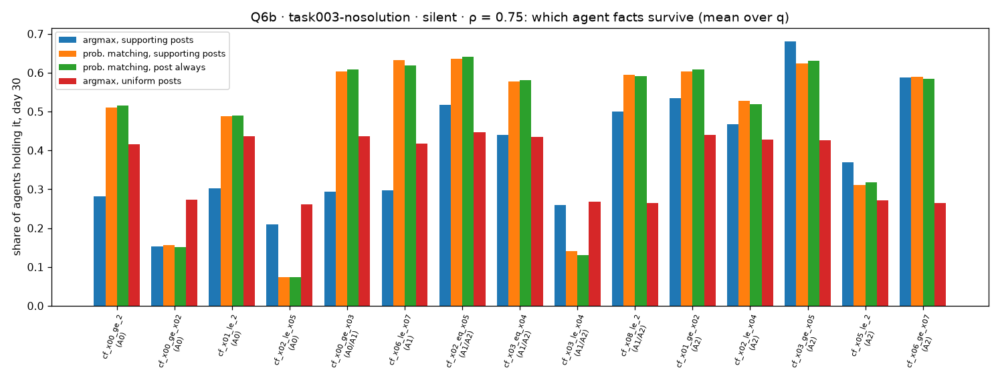

# Q6 — mechanisms

**7 October 2026.** Script: [`q6_mechanisms.py`](q6_mechanisms.py). Tables in
[`tables/`](tables/) (`q6a_*`, `q6b_*`, `q6c_*`).

## Summary

- **(a) Uniform posting leans to A0 at full memory because of which facts arrive
  last, combined with argmax voting.** Facts held by only one agent at the start
  spread slowest, so nearly complete memories usually lack one of them. Missing two
  particular A2-side facts tips a memory slightly toward A0, and argmax turns that
  slight lean into a full A0 vote; missing the others leaves an exact tie.
- **(b) Under the base rule, facts survive selectively.** In task003-nosolution at
  ρ = 0.75, facts favouring A2 are held by 53% of agents on day 30, facts favouring
  A0 by 24%. Uniform posting flattens the difference; facts held by one agent at the
  start die out most under the supporting-post rules.
- **(c) Extra truth posts reduce own-evidence proofs through posting, not
  reading.** Controller posts are 0.1–1.5% of what agents read under either rule.
  But agents pass controller facts on in place of their own original evidence, so
  the original evidence circulates less.

---

## (a) The A0 lean under uniform posting (task003-nosolution, silent, ρ = 1)

All 15 agent facts together give exactly (0.5, 0, 0.5), so the lean must come from
memories that are not complete. Day 30, uniform posting, averaged over q:

| facts held (of 15) | share of agents | vote margin A2 − A0 |
|---|---|---|
| 15 | 36% | −0.01 |
| 14 | 41% | **−0.27** |
| 13 | 18% | −0.39 |
| 12 | 4% | −0.47 |

Agents missing exactly one fact, by which fact, with the lean of "all 15 but that
fact" ([`tables/q6a_missing_one_fact.csv`](tables/q6a_missing_one_fact.csv)):

| missing fact | favours | held at start by | lean A2 − A0 without it | share of all agents |
|---|---|---|---|---|
| `cf_x06_ge_x07` | A2 | 1 agent | **−0.10** | 6.6% |
| `cf_x05_le_2` | A2 | 1 | 0 (tie) | 6.0% |
| `cf_x03_le_x04` | A1/A2 | 1 | 0 (tie) | 5.8% |
| `cf_x08_le_2` | A1/A2 | 1 | **−0.35** | 5.5% |
| `cf_x00_ge_x02` | A0 | 1 | 0 (tie) | 5.4% |
| `cf_x02_le_x05` | A0 | 1 | 0 (tie) | 5.1% |
| the 9 facts held by 2 agents | | 2 | various | 0.5–0.9% each |

- **The slowest facts are the six held by one agent at the start**; facts held by
  two spread from two places and arrive earlier.
- **Only two missing facts give a lean**, and both lean toward A0. Missing any
  other singleton leaves an exact tie, which argmax breaks at random (no net effect).
- **Argmax turns a slight lean into a full vote.** The predicted margin among
  14-fact agents is (5.5% + 6.6%) / 41% ≈ −0.30, against −0.27 observed.
- As the last facts arrive, memories complete and ties return: that is why the lean
  fades late at q = 12 (Q1).

So the lean is real but narrow: it comes from **two specific facts**, their single
holders, and argmax. It is a property of this fact assignment, not a general
property of uniform posting.

## (b) Which facts survive

Share of agents holding each kind of agent fact on day 30, silent arms, averaged
over q ([`tables/q6b_fact_prevalence.csv`](tables/q6b_fact_prevalence.csv)):

| setup | ρ | facts favouring | base | prob. matching | uniform posts |
|---|---|---|---|---|---|
| nosolution | 0.75 | A0 | **0.24** | 0.31 | 0.35 |
| | | A2 | **0.53** | 0.53 | 0.37 |
| | 1.0 | A0 | 0.51 | 0.68 | 0.93 |
| | | A2 | 0.77 | 0.84 | 0.94 |
| symmetric | 0.75 | A0 | 0.52 | 0.45 | 0.33 |
| | | A2 | 0.36 | 0.45 | 0.36 |

- **Base: the side that wins the vote keeps its evidence alive.** Agents post only
  facts supporting their vote, the A2 majority posts A2 facts, and with forgetting
  (ρ = 0.75) unposted facts die. In task003-symmetric the same mechanism favours A0.
- **Probability matching keeps more of A1's facts and the A0/A1 facts alive**
  (0.60–0.64), since agents sometimes vote A1 and then post A1-supporting facts.
  A2 facts still outlive A0 facts in task003-nosolution (0.53 against 0.31),
  matching the small A2 lean left under probability matching at ρ = 0.75 (Q1).
- **Uniform posting flattens survival** (0.35–0.44 across kinds).
- **Facts held by one agent at the start die out most** under the supporting-post
  rules (as low as 0.07): they have one source and are passed on only when they
  support the poster's vote.

## (c) Why extra truth posts lower own-evidence proofs (Q5)

Symmetric truth controller, q = 6, qc = 12, all days, rule on vs off
([`tables/q6c_crowding.csv`](tables/q6c_crowding.csv)):

| variant | ρ | b | rule | posts read that are controller posts | agent posts of own evidence | agent posts of pool facts | own-evidence facts held |
|---|---|---|---|---|---|---|---|
| base | 0.75 | 3 | on | 0.25% | 94.2% | 14.7% | 6.90 |
| base | 0.75 | 3 | off | 0.28% | 93.3% | 15.6% | 6.83 |
| prob. matching | 0.75 | 3 | on | 1.34% | 78.3% | 27.3% | 5.81 |
| prob. matching | 0.75 | 3 | off | 1.50% | 76.1% | 29.3% | 5.67 |
| prob. matching | 1.0 | 3 | on | 0.84% | 84.7% | 20.3% | 10.07 |
| prob. matching | 1.0 | 3 | off | 0.91% | 83.0% | 21.9% | 9.95 |

(Own-evidence and pool facts overlap: two A0-pool facts are also agent facts, so
the two posting columns can sum to more than 100%.)

- **Not reading:** controller posts are at most 1.5% of what agents read under
  either rule. They cannot crowd agents' facts out of the reading slots.
- **Posting:** with the rule off, agents post controller-pool facts more and their
  own original evidence less. A controller fact read on an earlier day counts as
  the agent's own and, once it supports the vote, competes with the original
  evidence for the agent's one post a day. The original evidence then circulates
  less, and fewer agents assemble a proof from it.
- **The fallback is not the channel**: posts made by the read-alone fallback barely
  change between the rules.

## What this means

- The dynamics of Simulation 1 are driven by **what agents choose to pass on**:
  argmax plus vote-supporting posts make the majority's evidence survive and the
  minority's die, and with one post a day any extra fact displaces another.
- Facts **held by a single agent at the start** are fragile under every rule. The
  setups' duplication pattern (which facts start with two holders) therefore
  matters more than its "8 agents per allocation" bookkeeping suggests.
- A controller helping the truth does not automatically help the agents' **own**
  proof: its facts displace the agents' evidence in what gets posted.
