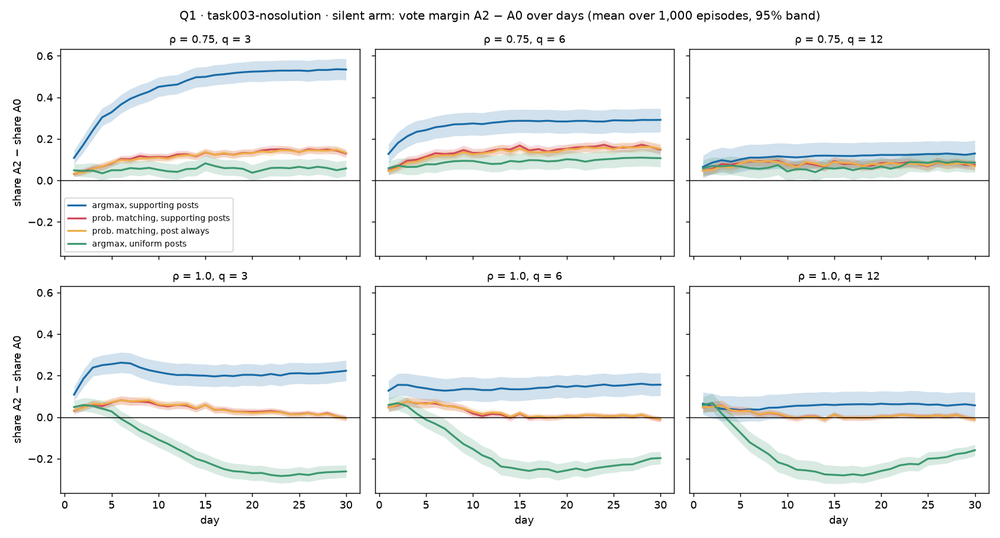
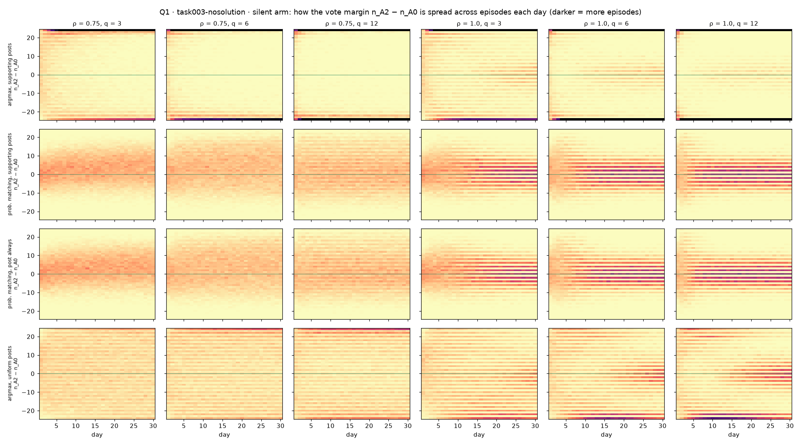

# Q0 and Q1 — sanity checks, and what drives the A2 drift

**7 October 2026.** Simulation 1 runs of 7 October (commit `830ecec`), analysed
as set out in [`ANALYSIS_PLAN.md`](ANALYSIS_PLAN.md). Scripts: [`q0_sanity.py`](q0_sanity.py),
[`q1_drift.py`](q1_drift.py). Full outputs: `results/simulation_1/analysis/2026-10-07/` (not in
git; `index.csv` lists every file). The figures and small tables quoted here are
copied into [`figures/`](figures/) and [`tables/`](tables/).

## Summary

- **Q0: the runs are sound.** No invariant is violated in any of the 2,448
  cells (1.76 billion agent-days, 69.6 million nights). Starting votes follow the
  voting rule. The base run reproduces the 6 October silent results.
- **Q1: the A2 drift is a lock-in effect, not a slow drift.** Under the base
  rule (argmax votes, post a fact supporting the vote) **63–91% of no-solution
  episodes end unanimous**: all 24 agents on A2 (43–67% of episodes) or all on A0
  (15–41%). The mean margin toward A2 is the difference between those two groups.
  A2 wins more often because the swarm starts with more A2 voters (7 / 6 / 11).
- **The lock-in needs both argmax voting and vote-supporting posts.** Change
  either one and unanimity almost disappears, and the drift shrinks.
- **The same mechanism helps the truth in task003-symmetric**, where the start
  favours A0 (9 / 7 / 8). But it can also lock a swarm that owns a proof onto
  the wrong answer: with full memory and q = 12, **7% of base episodes end with
  all 24 agents on A2**.

---

## Q0 — sanity checks

**Invariants.** All 16 checks are zero over every cell of every run: posts come
from memory; memory bookkeeping adds up; proof from own evidence never exceeds
proof from all facts; agents never read more than q posts; the controller posts
0 or b facts, never after the last day, never when gated or when the target is
proved (rule on), and `posted_proved` appears only with the rule off; abstention
only where the variant allows it; vote shares sum to 1.

**Starting votes.** On day 1 the first agent in the order has read nothing, so
its vote comes from its own fact alone. Its votes over 1,000 episodes match the
voting rule's prediction in every variant and setup (all |z| < 1.2;
[`tables/q0_first_votes.csv`](tables/q0_first_votes.csv)). Expected starting
votes of the whole population, A0 / A1 / A2:

| | argmax (base, uniform posting) | probability matching |
|---|---|---|
| task003-nosolution | **7 / 6 / 11** | 8.3 / 7.4 / 8.3 |
| task003-symmetric | 9 / 7 / 8 | 8.8 / 7.5 / 7.7 |

*Correction to the plan:* it said starting votes would show on day 1, but most
day-1 agents have read earlier posts before voting. Only the first agent of the
day-1 order votes from its own fact alone, so that is what was checked.

**6 October reference.** The base run's silent cells reproduce it: 10 of 12 to
three decimals, and the other two sit exactly on a rounding boundary (0.3535
against 0.354, 0.5275 against 0.528) ([`tables/q0_reference.csv`](tables/q0_reference.csv)).

**Posting reasons** ([`tables/q0_posting_reasons.csv`](tables/q0_posting_reasons.csv)):
- **Abstention is rare**, even under probability matching: 0.1–0.2% of agent-days.
  So `sim1_pm` and `sim1_pm_post_always` behave almost identically, and abstention
  cannot cause much sensing bias.
- **The "read alone" fallback is common in the symmetric truth arm** (4% of posts
  under argmax, 12% under probability matching): agents whose memory holds proofs
  built with the controller's A0 facts, where no single fact matters in context.
  Without the fallback those agents would fall silent.

---

## Q1 — the A2 drift (silent arms only)

### The day-30 margin, share A2 − share A0

Positive means more A2 than A0 votes; 95% intervals in
[`tables/q1_final.csv`](tables/q1_final.csv).

| setup | ρ | q | base | prob. matching | prob. matching, post always | uniform posts |
|---|---|---|---|---|---|---|
| nosolution | 0.75 | 3 | **+0.53** | +0.13 | +0.13 | +0.06 |
| | | 6 | **+0.29** | +0.15 | +0.15 | +0.11 |
| | | 12 | +0.13 | +0.07 | +0.07 | +0.09 |
| | 1.0 | 3 | **+0.22** | −0.01 *(0 in interval)* | −0.01 *(0 in interval)* | **−0.26** |
| | | 6 | +0.16 | −0.01 *(0 in interval)* | −0.01 *(0 in interval)* | **−0.20** |
| | | 12 | +0.06 | −0.01 *(0 in interval)* | −0.01 *(0 in interval)* | **−0.16** |
| symmetric | 0.75 | 3 | −0.92 | −0.41 | −0.40 | −0.48 |
| | | 6 | −0.94 | −0.73 | −0.73 | −0.65 |
| | | 12 | −0.88 | −0.90 | −0.90 | −0.72 |
| | 1.0 | 3 | −1.00 | −1.00 | −1.00 | −1.00 |
| | | 6 | −0.94 | −1.00 | −1.00 | −1.00 |
| | | 12 | −0.86 | −1.00 | −1.00 | −1.00 |

### What the means hide: unanimity

Share of episodes in which **all 24 agents** vote the same way on day 30
([`tables/q1_unanimity.csv`](tables/q1_unanimity.csv)):

| setup | ρ | q | base: all A0 | base: all A2 | prob. matching: either | uniform: all A0 | uniform: all A2 |
|---|---|---|---|---|---|---|---|
| nosolution | 0.75 | 3 | 0.15 | **0.67** | 0.00 | 0.04 | 0.06 |
| | | 6 | 0.28 | **0.63** | 0.00 | 0.05 | 0.10 |
| | | 12 | 0.35 | **0.54** | 0.00 | 0.08 | 0.15 |
| | 1.0 | 3 | 0.20 | **0.43** | 0.00 | 0.09 | 0.01 |
| | | 6 | 0.30 | **0.47** | 0.00 | 0.10 | 0.01 |
| | | 12 | 0.41 | **0.47** | 0.00 | 0.08 | 0.01 |
| symmetric | 1.0 | 12 | 0.93 | **0.07** | 1.00 (all A0) | 1.00 | 0.00 |

Top row (base): nearly every episode ends at +24 (all A2) or −24 (all A0).
Rows 2–3 (probability matching): spread around 0, no lock-in. Bottom row
(uniform posts): broad, with some lock-in toward A0 at ρ = 1.

### Reading

1. **Base = a lock-in machine.** Argmax turns any lead into a vote, and agents
   then circulate only facts supporting that vote, so later readers see one
   side's evidence. Episodes snowball to unanimity. Which side wins is decided
   early, and the 7 / 6 / 11 start gives A2 the better odds. **Reading more (q)
   does not weaken the lock-in**: the share of unanimous episodes stays the same
   or grows with q (ρ = 1: 63%, 78%, 88% for q = 3, 6, 12). What changes is
   which side wins: more episodes lock onto A0, which shrinks the A2 lead.
2. **Remove either ingredient and the lock-in collapses.**
   - Probability matching, supporting posts: no unanimous episode at all in
     task003-nosolution. With full memory the margin is 0 (the pooled evidence
     is 50/50). With forgetting a small A2 lean remains (+0.07 to +0.15).
   - Argmax, uniform posts: unanimity falls to 9–22% of episodes.
3. **Uniform posting with full memory overshoots to A0** (margin −0.16 to
   −0.26). The trajectory starts toward A2, crosses zero around day 5, and
   settles on the A0 side; at q = 12 it drifts back toward 0 late. Pooling all
   the agents' facts gives exactly 50/50, so this lean comes from intermediate
   memory states, not from the pooled evidence. **Not yet explained** — a Q6
   (fact-level) question.
4. **In task003-symmetric the same lock-in mostly helps the truth** (the start
   favours A0), but at ρ = 1 and q = 6–12 it locks 3–7% of base episodes onto
   all-A2 despite the agents jointly owning a proof. Neither alternative rule
   does this: both reach 100% A0.
5. **Abstention plays no role**: probability matching with and without
   `agent_post_always` agree to within 0.01 everywhere.

### Consequences for the next questions

- **Q2 must compare the controller with the right silent twin.** In the
  no-solution base variant the silent arm already ends unanimous on A2 in up to
  two thirds of episodes, so a false controller's raw A2 share overstates what
  it achieves.
- **Means are not enough** for base-variant cells: report the split into
  unanimous A0, unanimous A2 and mixed episodes next to every mean.
- The reviewing agent's diagnosis (argmax + vote-conditioned posting) is
  **confirmed**, with two refinements: the mechanism is lock-in to unanimity,
  and uniform posting is not neutral either.
