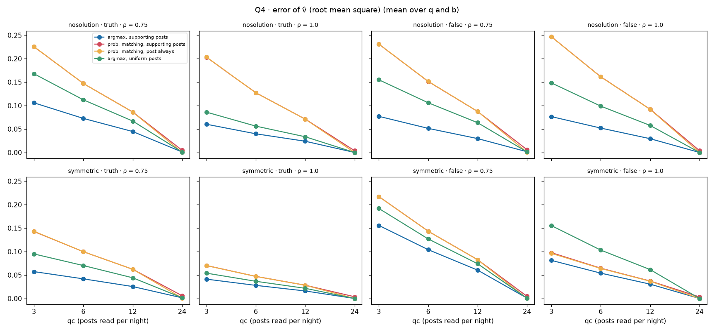
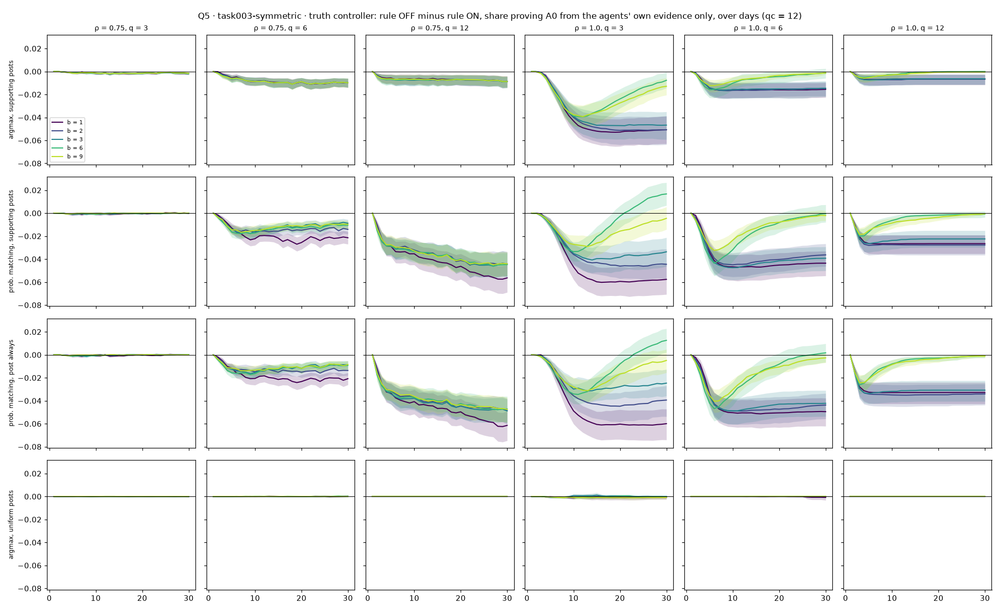

# Q4 and Q5 — sensing, and the stopping rule

**7 October 2026.** Main and no-proof-stop runs of 7 October, analysed as set out in
[`ANALYSIS_PLAN.md`](ANALYSIS_PLAN.md). Scripts: [`q4_sensing.py`](q4_sensing.py),
[`q5_stopping.py`](q5_stopping.py). Tables: [`tables/q4_sensing.csv`](tables/q4_sensing.csv),
[`tables/q5_final.csv`](tables/q5_final.csv); full outputs in
`results/simulation_1/analysis/2026-10-07/`.

## Summary

- **Q4: the controller senses the swarm accurately.** Its estimate v̂ is unbiased,
  its error shrinks with qc as random sampling predicts, and abstention does not
  distort it. Gate mistakes are rare under argmax voting (under 1% of nights) and
  reach 5–13% under probability matching, where the swarm hovers near the 0.75
  threshold.
- **Q5: switching off `silent_when_target_proved` changes little, because the vote
  gate already does the stopping.** The rule fires on about 30% of nights, but with
  it off the truth controller posts on only 0.3–2% of nights. The small extra dose
  raises the share of agents holding a proof (+0.002 to +0.016), but **lowers** the
  share holding one from their own evidence (−0.01 to −0.06): the controller's
  facts become a shortcut rather than help assembling the agents' own proof.

---

## Q4 — sensing

### Accuracy of v̂

v̂ = share of the agent posts the controller read whose author voted for its
target. Compared, every night, with the true share of all 24 agents (mean over
setups, arms, q, b, ρ):

| variant | qc = 3 | qc = 6 | qc = 12 | qc = 24 |
|---|---|---|---|---|
| bias, all variants | 0.000 | 0.000 | 0.000 | 0.000 |
| error (rmse), base | 0.082 | 0.055 | 0.033 | 0.001 |
| error (rmse), prob. matching | 0.179 | 0.118 | 0.069 | 0.005 |
| error (rmse), uniform posts | 0.132 | 0.089 | 0.053 | 0.001 |

- **No bias** (|bias| ≤ 0.0005 everywhere). Each agent posts once a day, so the
  day's board is close to a census of votes, and reading qc of its posts at random
  is an unbiased sample.
- **The error falls with qc**, as sampling without replacement predicts. At qc = 24
  the controller reads (almost) every post, so v̂ is exact.
- **The error is larger under probability matching** because its swarms are mixed
  (no lock-in), so a small sample varies more.

### Abstention

Abstention exists only under probability matching with `agent_post_always: false`,
in 0.1–0.2% of agent-days. It falls mostly on agents voting **A1** (2–3% of A1 votes
abstain, against under 0.3% of A0 or A2 votes): probability matching sometimes draws
A1, which the agents' facts rarely support. Its effect on sensing is nil: the
posters' target share differs from the true share by at most 0.0004.

### Gate mistakes

| | qc = 3 | qc = 6 | qc = 12 | qc = 24 |
|---|---|---|---|---|
| wrongly silent, base | 0.8% | 0.8% | 0.7% | 0% |
| wrongly silent, prob. matching | 5.4% | 5.4% | 4.7% | 0% |
| wrongly posting, base | 3.0% | 1.2% | 0.4% | 0% |
| wrongly posting, prob. matching | 13.2% | 7.2% | 2.7% | 0% |

"Wrongly silent" = the gate held the controller back although the true share was
below 0.75; "wrongly posting" = it posted although the true share was already ≥ 0.75.
Mistakes need a swarm near the threshold: under probability matching, in
task003-nosolution with the false controller, the true share is below 0.75 on 60% of
nights; under the base rule on 12%. At qc = 3 the effective gate is stricter (3 of
3), which is why wrongly posting dominates there.

---

## Q5 — `silent_when_target_proved`

The rule only matters for the truth controller in task003-symmetric. Each of its
120 cells per variant was run with the rule off and compared, episode by episode,
with the same cell with the rule on. Day 30, mean over q, qc and b:

| variant | ρ | nights the rule fires (on) | nights posting despite proof (off) | extra facts posted | Δ A0 share | Δ agents proving A0 (all facts) | Δ agents proving A0 (own evidence) |
|---|---|---|---|---|---|---|---|
| base | 0.75 | 29% | 0.3% | +0.24 | +0.001 | +0.006 | **−0.012** |
| base | 1.0 | 32% | 0.3% | +0.28 | 0.000 | 0.000 | **−0.029** |
| prob. matching | 0.75 | 34% | 2.3% | +1.6 | +0.009 | +0.016 | **−0.044** |
| prob. matching | 1.0 | 31% | 0.8% | +0.8 | 0.000 | 0.000 | **−0.057** |
| uniform posts | 0.75 | 3% | 0.04% | +0.01 | 0.000 | 0.000 | 0.000 |
| uniform posts | 1.0 | 14% | 0.02% | +0.01 | 0.000 | 0.000 | 0.000 |

(Δ = rule off minus rule on.)

- **The vote gate already does the stopping.** On most nights where the board proves
  A0, at least 75% of the posts the controller reads already vote A0, so the gate
  keeps it silent whether or not the stopping rule is on. With the rule off, the
  controller posts on at most 2% of nights.
- **More agents hold a proof** with the rule off: significant in 83 of 480 cells,
  always positive, at least one agent in 15 cells (all at ρ = 0.75; 13 under
  probability matching; 9 at b ≤ 2; 12 at q = 6).
- **Fewer agents hold a proof from their own evidence.** The extra controller facts
  give agents a proof route through the controller's facts instead. A likely reason,
  not yet verified: controller posts occupy reading slots, so agents read fewer of
  each other's facts. This is the distinction the two proof measures were added for,
  and it is the case your concern anticipated: a proof on the board is not the
  agents' own proof.
- **No effect at ρ = 1 on the overall proof rate**: with full memory nearly every
  agent already holds a proof (99.97%).

## What this means

- The controller's sensing is not a weak point of Simulation 1; any controller
  failure comes from what it posts, not from what it sees.
- `silent_when_target_proved` is nearly redundant next to the vote gate. Testing
  the stopping rule properly would need the gate off (`controller_gate: always`) as
  well, a separate small study, if you want it.
- The own-evidence proof rate is the right outcome for "does the controller help
  the swarm assemble its proof": by it, extra truth posts slightly hurt.
