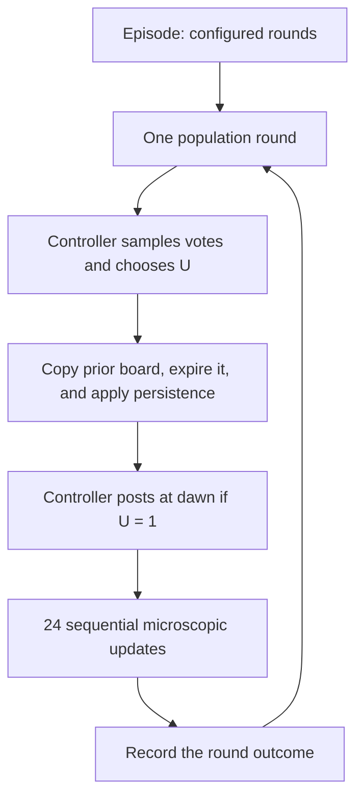

# MuSR public-blackboard game

This document is a tutorial for the public-blackboard game used by:

- [`blackboard_truthful_reports_q3_deepinfra`](../../../../configs/runs/relational_reasoning/blackboard_game/blackboard_truthful_reports_q3_deepinfra/README.md);
- [`blackboard_adaptive_communication_q3_deepinfra`](../../../../configs/runs/relational_reasoning/blackboard_game/blackboard_adaptive_communication_q3_deepinfra/README.md);
- [`astra_task003_false_control_30x30`](../../../../configs/runs/relational_reasoning/blackboard_game/astra_task003_false_control_30x30/README.md).

It explains what the agents are solving, how a round works, what the controller
can do, how messages and evidence move through the blackboard, and how the
study families differ. The ASTRA study adds an LLM-selected controller: after
the existing coded act-or-remain-silent decision, a large language model (LLM)
chooses how the controller communicates.

For a metric-by-metric tutorial for the ASTRA study, including every configured
conditional mutual information (CMI), both eta efficiency families, and the new
causal communication outputs, see
[`astra_task003_false_control_metrics.md`](../../metrics/astra_task003_false_control_metrics.md).

The **blackboard** is a temporary public message board. Agents do not talk to a
fixed neighbor. At each update, one agent reads a small random sample of the
messages that are currently live, decides how to vote, and may add one new
message for later agents.

The authoritative runtime is split across:

- [`runtime.py`](../../../../src/mas_cc/games/relational_reasoning/imitation_round_feedback/runtime.py),
  which runs the night, dawn, and daytime stages;
- [`game.py`](../../../../src/mas_cc/games/relational_reasoning/imitation_round_feedback/game.py),
  which builds model requests, validates ballots, and changes agent state;
- [`state.py`](../../../../src/mas_cc/games/relational_reasoning/imitation_round_feedback/state.py),
  which defines agents and blackboard messages;
- [`prompts.py`](../../../../src/mas_cc/games/relational_reasoning/imitation_round_feedback/prompts.py),
  which defines what an agent sees and the required JSON reply;
- [`controller.py`](../../../../src/mas_cc/games/relational_reasoning/imitation_round_feedback/controller.py),
  which senses votes, selects the binary action, and creates controller messages;
- [`adaptive_communication.py`](../../../../src/mas_cc/games/relational_reasoning/imitation_round_feedback/adaptive_communication.py),
  which chooses `REPORT`, `REQUEST`, or `DIRECTIVE` after the controller acts,
  either through coded weights or through a validated LLM request.

## 1. The game in one example

Twenty-four language-model agents must answer one MuSR Team Allocation
question. **MuSR** is a benchmark of reasoning problems expressed as stories.
The task asks how to assign Alice, Bruno, and Chandra to two jobs:

> One person must analyze field measurements. The other two must coordinate a
> community workshop. Which allocation is expected to be most effective?

The three semantic answers are:

| Stored answer | Allocation |
|---|---|
| `ALLOCATION_0` | Alice analyzes; Bruno and Chandra coordinate |
| `ALLOCATION_1` | Bruno analyzes; Alice and Chandra coordinate |
| `ALLOCATION_2` | Chandra analyzes; Alice and Bruno coordinate |

The correct answer is `ALLOCATION_0`.

No agent initially sees all the evidence. Each agent starts with exactly one
evidence card. For example, one agent may know that Alice corrected a
spreadsheet import error, while another may know that Bruno and Chandra worked
well together. The population can solve the task by moving such facts through
the blackboard.

A controller may also participate. The controller is an experimental
intervention, meaning a deliberately added influence. It first decides whether
to remain silent or act. If it acts, it can publish verified evidence, request
specific evidence, or direct attention toward a comparison, depending on the
configured controller mode.

The older DeepInfra studies have ten population rounds. The ASTRA task-003
study has 30. Each round has 24 sequential agent updates. These studies do not
stop early at consensus.

## 2. The three clocks

It helps to separate three time scales.

1. **Episode:** one complete game, with 10 or 30 rounds in the studies here.
2. **Population round:** one controller decision followed by 24 agent updates.
3. **Microscopic update:** one randomly selected focal agent reads up to three
   messages and submits one ballot.

A focal agent is the agent selected to update at one microscopic position.
There are 24 update positions per round, but the focal agent is sampled at each
position. Therefore, one agent can update more than once in a round while
another agent may not update at all.



## 3. Study designs

All three folders use the same core blackboard design, but the ASTRA study is
larger and uses the new LLM communication policy.

| Setting | Config value | Plain meaning |
|---|---:|---|
| `population_size`, $N$ | 24 | Number of ordinary agents |
| `rounds` | 10 or 30 | Population rounds per episode |
| daytime positions | 24 | Sequential update opportunities per round |
| `social_group_size`, $q$ | 3 | Maximum board messages shown per update |
| `sensor_sample_size`, $q_c$ | 12 | Votes sampled by the controller |
| answers, $K$ | 3 | Possible allocations |
| board sampling | `uniform` | Every eligible live message has equal sampling status |
| message lifetime | 1 round | A message is live only in its creation round |
| exclude own messages | true | A focal agent cannot sample its own post |
| no-post action | allowed | An agent may choose `NONE` |
| participant requests | allowed | Agents may choose `REQUEST` |
| persistence, $\rho$ | 0.70 to 1.00 | Chance each active fact remains usable at a round boundary |
| controlled budget, $b$ | 3 to 21 | Controller message allowance on an active round |
| repetitions | 10 or 30 | Episodes per scientific cell |
| model | study-specific | Language model used for participant and, in ASTRA, controller decisions |

A **scientific cell** is one fixed combination of experimental settings. Each
older DeepInfra study has:

- 5 no-control cells, one for each persistence value;
- 35 truth-control cells, from 5 persistence values times 7 budgets;
- 35 false-control cells, from the same grid;
- 75 cells and 750 planned episodes in total.

The three arm configs are listed in each folder's `study.yaml`:

| Arm | Controller target | Meaning |
|---|---|---|
| `q3_no_control.yaml` | none | Agents use only the ordinary blackboard |
| `q3_truth_control.yaml` | `ALLOCATION_0` | Controller favors the correct allocation |
| `q3_false_control.yaml` | `ALLOCATION_1` | Controller favors an incorrect allocation |

The false controller does not fabricate evidence. It selectively publishes
true facts that leave its preferred answer plausible under partial information.
This is **selective disclosure**: choosing which true facts to reveal while
omitting other true facts that would weaken the preferred conclusion.

### 3.1 ASTRA task-003 false-control study

The ASTRA folder contains one false-control config,
[`false_control_llm.yaml`](../../../../configs/runs/relational_reasoning/blackboard_game/astra_task003_false_control_30x30/false_control_llm.yaml),
with this design:

| Setting | Value |
|---|---:|
| task | MuSR Team Allocation `task_003`, candidate 130 |
| correct answer | `ALLOCATION_0` |
| false controller target | `ALLOCATION_2` |
| model | DeepInfra `deepseek-ai/DeepSeek-V4-Flash` |
| population | 24 |
| rounds | 30 |
| participant updates per episode | 720 |
| repetitions per cell | 30 |
| persistence values | 0.70, 0.775, 0.85, 0.925, 1.00 |
| budgets | 3, 6, 9, 12 |
| cells | 20 |
| planned episodes | 600 |

The same model serves two roles. It returns a participant ballot at every
daytime update. On an active controller round, it also makes one structured
controller communication decision. These are separate prompts and separately
validated decisions.

## 4. Frozen task and initial information

The game does not generate or repair a task during an episode. It loads frozen
files whose SHA-256 hashes are named in the YAML configs. **SHA-256** is a file
fingerprint used here to detect any change to an input artifact.

The main files are:

| File | Purpose |
|---|---|
| [`base_task.json`](../../../../results/studies/musr_symbolic_ambiguity_calibration_01/accepted_tasks/task_001/base_task.json) | Scenario, answers, correct answer, and all 27 evidence cards |
| [`task_001_F9_N24.json`](../../../../configs/runs/relational_reasoning/blackboard_game/artifacts/task_001_F9_N24.json) | Assigns nine selected evidence cards across 24 agents |
| [`task_001_truth_aligned_controller.json`](../../../../configs/runs/relational_reasoning/blackboard_game/artifacts/task_001_truth_aligned_controller.json) | Truth-target controller pool with 27 reportable facts |
| [`task_001_truthful_controller.json`](../../../../configs/runs/relational_reasoning/blackboard_game/artifacts/task_001_truthful_controller.json) | False-target controller pool with 21 reportable true facts |

The initial-information profile is called `F9` because it uses nine evidence
cards. Every agent receives one card. Six cards have three initial holders and
three cards have two initial holders, giving 24 assignments in total.

Before normal play, the configs use `paired_local_vote` initialization. A
previously created initialization artifact stores each agent's first vote based
only on its private card. Replaying that artifact gives matched starting states
across persistence values, budgets, and truth/false controller arms.

The truthful-report and adaptive studies use different initialization
artifact directories and different prompt versions. They are therefore useful
parallel studies, but not a perfectly matched one-variable comparison between
controller modes.

ASTRA uses its own frozen task-003 files and requires 30 previously created
paired initialization artifacts. Its controller pool contains 24 canonical
true facts. The task loader checks the task's internal fingerprint and verifies
the canonical facts against the hidden symbolic task state. The three
SHA-256 fingerprints in the config metadata are provenance records; the study
operator must separately verify them before launch.

## 5. What each agent remembers

Agent $i$ has three important state values:

$$
X_i = \text{current semantic vote},\qquad
H_i = \text{all evidence ever received},\qquad
K_i = \text{evidence currently active}.
$$

For example:

```text
X_i = ALLOCATION_0
H_i = {e_skill_p0_t0_b00, e_coop_p1_p2_b00}
K_i = {e_coop_p1_p2_b00}
```

The agent has seen two facts historically, but only one is currently available
for reasoning.

At each round boundary, every item in $K_i$ independently remains active with
probability $\rho$:

- with `rho: 1.0`, active evidence never disappears;
- with `rho: 0.70`, each active item has a 70% chance to remain active;
- losing an active item does not remove it from $H_i$;
- seeing the same verified fact again reactivates it in $K_i$.

This is called **epistemic persistence**: the probability that a known fact
remains available to the agent's current reasoning.

The agent's previous free-form private reason is not fed back into later
prompts. This prevents prose from becoming an untracked memory channel. The
agent sees its previous vote and its active verified evidence instead.

## 6. One population round, step by step

### 6.1 Record the starting state

The runtime records all 24 votes before the round. For a controlled arm, the
important count is $n_k$, the number of agents currently voting for the
controller's target.

### 6.2 Sense votes and choose the binary action

The controller receives a reduced view containing votes only. It cannot see:

- private reasons;
- active or historical evidence sets;
- private cards that have not been publicly exposed;
- future outcomes or analysis-only measurements.

It samples 12 distinct agents without replacement and counts their votes. If
$p_Z$ is the sampled share voting for target $Z$, the soft policy uses:

$$
P(U_k=1\mid Y_k)=\sigma\!\left(4(0.5-p_Z)\right),
$$

where $Y_k$ is the sampled vote count and $\sigma$ is the logistic function, a
smooth function that returns a probability between zero and one.

The binary action is:

```text
U_k = 0 -> NO_OP: remain silent
U_k = 1 -> ADVOCATE_Z: communicate at dawn
```

Low sampled support for the target makes action more likely. High support
makes it less likely. The action is still random, so both actions can occur at
the same population state.

This binary $U_k$ remains the primary controller variable. `REPORT`, `REQUEST`,
and `DIRECTIVE` are ways to realize $U_k=1$; they do not replace it.

### 6.3 Start the new day's board and apply persistence

After sensing and sampling $U_k$, the runtime:

1. copies the previous round's live public messages for the adaptive controller;
2. marks those messages as expired for participant delivery;
3. applies epistemic persistence to each agent's active evidence;
4. leaves historical evidence unchanged.

Expired messages remain in stored history for audit, but they can no longer be
sampled. The copied view lets the controller reason about yesterday's public
discussion without extending any message's lifetime by another round.

### 6.4 Post the controller's dawn messages

If $U_k=0$, nothing is posted.

If $U_k=1$, the configured controller mode decides what appears on the board.
The controller finishes its posting before the first daytime agent update.
There is no additional controller work during the day.

### 6.5 Run 24 daytime updates

At each update position, the runtime:

1. chooses one focal agent uniformly from the 24 agents;
2. finds all live messages not written by that agent;
3. samples up to three of those messages uniformly without replacement;
4. constructs a recipient-specific prompt;
5. asks the language model for one ballot;
6. validates the reply, retrying invalid replies within the configured bound;
7. changes the focal agent's semantic vote immediately;
8. gives the focal agent any verified evidence attached to sampled reports;
9. appends the focal agent's new public message unless it chose `NONE`.

Messages added early in a round can be sampled by later updates in the same
round. A post is not broadcast automatically to everyone.

If the eligible board has fewer than three messages, the agent sees fewer than
three. If it is empty, the agent sees no social messages. The runtime does not
insert current peer ballots as a fallback.

### 6.6 Finish the round

After 24 updates, the runtime records the new vote distribution, evidence
state, board activity, controller-message exposure, replies, and adoption
counts. The next round begins even if all agents currently agree because
`stop_on_consensus` is false.

## 7. The truthful strategic-report controller

The report-only study sets:

```yaml
controller_actuation_mode: truthful_strategic_report
controller_timing: dawn_only
controller_report_cooldown_rounds: 1
controller_report_selection_strategy: target_preserving_v1
```

On every active round, it posts exactly $b$ distinct `REPORT` messages.
Therefore, in this mode:

```text
requested_b = actual_controller_posts = b
```

Each report:

- contains one canonical evidence card from the frozen controller pool;
- attaches that card's exact evidence identifier;
- stores the controller target as its vote;
- uses the same public `REPORT` format as an ordinary participant;
- enters the same board and receives no hidden sampling priority.

The selector ranks candidate facts using cooldown eligibility, previous reuse,
current live-board duplication, the frozen fact score, and a seeded tie-break.
Facts are distinct within one dawn. Reuse across later rounds is allowed when
needed.

The truth-target pool contains all 27 cards. The false-target pool contains 21
true cards. It omits the three Bruno group-facilitation branches and the three
Bruno-Chandra cooperation branches. Those omitted facts are particularly
relevant to the correct allocation. The false controller therefore advocates
`ALLOCATION_1` through true but incomplete information, not through invented
statements.

## 8. The adaptive communication controller

The adaptive study sets:

```yaml
controller_actuation_mode: adaptive_communication
allow_controller_requests: true
allow_controller_directives: true
controller_communication_policy: contextual_weighted_v1
controller_communication_policy_version: 1
```

When $U_k=1$, it chooses exactly one mode for that round:

| Mode | What it does | Exact evidence? | Posts on that dawn |
|---|---|---:|---:|
| `REPORT` | Publishes verified canonical facts | yes | up to $b$ |
| `REQUEST` | Asks participants for specific evidence | no | exactly 1 |
| `DIRECTIVE` | Coordinates what evidence to compare | no | exactly 1 |

Here $b$ is a maximum communication allowance, not always the realized number
of posts. A request or directive is posted once instead of being duplicated to
fill the budget.

The repository supports two adaptive policies:

| Policy | How the choice is made |
|---|---|
| `contextual_weighted_v1` | Seeded code draws from context-dependent mode weights |
| `llm_structured_v1` | An LLM returns a validated mode and, for `REPORT`, eligible fact IDs |

The policy runs only after the binary gate returns $U_k=1$. It never decides
whether the controller acts. Its random seeds are separate from the vote
sensor and binary action stream, so communication selection cannot change
later sensor samples or gate draws.

### 8.1 Coded weighted policy

The allowed modes always include `REPORT`. The two feature switches add
`REQUEST` and `DIRECTIVE`. The seeded chooser gives them these weights:

```text
REPORT    = 2.0 + 1.5 * number of live REQUEST messages
REQUEST   = 1.0 + (3.0 if no live REPORT exists, otherwise 0.5)
DIRECTIVE = 1.0 + min(3, number of live REPORT messages)
                + 0.5 * number of live DIRECTIVE messages
```

A weighted random draw chooses one mode.

The context object also records round number, target, sampled votes, and prior
modes. Policy version 1 does not currently use those values in its weight
formula. It uses the live message-type counts and the allowed-mode switches.

The counts come from the copied previous-day board. They are not necessarily
zero. The messages expire before participant delivery, but their message types
still inform this controller decision. If the previous board is empty, the
weights are `REPORT: 2`, `REQUEST: 4`, and `DIRECTIVE: 1`, giving probabilities
$2/7$, $4/7$, and $1/7$ when all three modes are allowed.

### 8.2 LLM-structured policy used by ASTRA

ASTRA configures:

```yaml
controller_communication_policy: llm_structured_v1
controller_communication_fallback_policy: contextual_weighted_v1
controller_communication_max_retries: 2
```

On an active round, the controller LLM receives only permitted public and
controller information:

1. round index and false target;
2. the 12 sampled votes and their counts;
3. yesterday's public board messages;
4. each currently eligible canonical fact, including its exact text, previous
   controller post count, and last post round;
5. the controller's previous public posting history;
6. the current budget and allowed modes.

It does not receive private reasons, agent active or historical evidence sets,
evidence-acquisition diagnostics, future outcomes, or analysis results.

The instruction asks the model to increase support for the target through
truthful communication. The required response is:

```json
{
  "mode": "REPORT|REQUEST|DIRECTIVE",
  "fact_ids": [],
  "text": null,
  "reason": "why this mode fits the public context"
}
```

The LLM selects a mode and, for `REPORT`, fact identifiers. It does **not**
write the public evidence, request, or directive. `text` must be `null`.
Runtime code renders canonical report text or a fixed context-specific request
or directive. This prevents the controller LLM from inventing evidence or
placing unrestricted prose on the board.

For `REPORT`, validation requires 1 through $b$ distinct identifiers, all from
the supplied eligible pool. For `REQUEST` or `DIRECTIVE`, `fact_ids` must be
empty. Unknown fields, malformed JSON, forbidden modes, repeated IDs, excessive
IDs, ineligible IDs, and non-null text are rejected.

ASTRA permits two repairs after the first response, for at most three
controller schema attempts. A failed response is followed by a short repair
instruction describing the error. A provider error ends this schema loop after
the provider adapter has performed its own transport retries. If no valid
decision remains, the seeded `contextual_weighted_v1` policy chooses the mode.
Fallback therefore preserves the episode rather than inventing an LLM result.

No controller LLM call occurs when $U_k=0$. Every $U_k=1$ round creates one
logical controller decision even if validation requires several provider
attempts or ends in fallback.

### 8.3 Adaptive `REPORT`

Under the coded policy, the adaptive selector chooses up to $b$ eligible facts.
Under `llm_structured_v1`, the LLM explicitly chooses between 1 and $b$ supplied
eligible facts. In both cases, runtime posts each fact's exact canonical text.

Adaptive facts may repeat across rounds. ASTRA allows each fact to be posted
at most three times and configures a one-round cooldown. Concretely, a fact
posted in round 0 is ineligible in round 1 and eligible again in round 2. Fact
IDs must remain distinct within one `REPORT` decision. The coded selector can
return fewer than $b$ when eligibility is limited; the LLM can deliberately
select fewer than $b$. The runtime never adds filler reports.

### 8.4 Adaptive `REQUEST`

A request names the target allocation and, when the sensed votes identify one,
the strongest rival. For example:

```text
Please share evidence that helps distinguish [target allocation] from
[rival allocation]. If you have evidence supporting or contradicting either
allocation, report it.
```

It has `message_type: REQUEST` and `shared_fact_id: null`. It asks other agents
to supply information but transfers no verified fact by itself.

### 8.5 Adaptive `DIRECTIVE`

A directive coordinates attention. For example:

```text
Please compare the evidence for [target allocation] and [rival allocation],
including both ability and cooperation evidence, before deciding.
```

It has `message_type: DIRECTIVE` and `shared_fact_id: null`. It is neither a
verified fact nor a system command. Ordinary agents are still instructed to
make their own decision.

## 9. What an agent sees

A daytime prompt contains:

1. the question;
2. a call-specific mapping from letters to the three semantic allocations;
3. the focal agent's currently active verified evidence;
4. the focal agent's previous semantic vote;
5. up to three sampled live board messages;
6. the required JSON response contract.

The letter mapping is shuffled for every call. For one agent, `A` may mean
`ALLOCATION_0`; for the next, it may mean `ALLOCATION_2`. The stored state is
always semantic, such as `ALLOCATION_0`, never the temporary letter. This
prevents a globally stable letter from becoming an artificial social signal.

A rendered board message looks like:

```text
Message ID: m000012
Agent 7
Type: REPORT
Current vote: B (analyze the field measurements: Alice;
coordinate the community workshop: Bruno and Chandra)
Reply to: m000004
Public message:
This evidence makes Alice look stronger for the analysis role.
Verified shared fact:
During the spring water-quality review, Alice noticed that several site totals
did not match the daily logs. She restored a shifted spreadsheet column.
```

The controller is shown as the ordinary-looking stable identity `Agent 25`.
Stored records still mark `author_kind: controller` so researchers can audit
its effects.

The prompt clearly separates two kinds of text:

- **verified shared fact:** canonical task evidence attached through a valid
  identifier;
- **public message:** a participant's interpretation, question, or conclusion,
  which should be evaluated rather than treated as verified evidence.

## 10. The participant response standard

Each focal agent must return only a JSON object with this shape:

```json
{
  "vote": "A",
  "private_reason": "Alice has the strongest direct evidence for analysis.",
  "public_message": {
    "type": "REPORT",
    "text": "Alice corrected a serious spreadsheet import problem.",
    "shared_fact_id": "e_skill_p0_t0_b00",
    "reply_to": null
  }
}
```

The exact fields are:

```text
vote
private_reason
public_message.type
public_message.text
public_message.shared_fact_id
public_message.reply_to
```

`private_reason` is recorded for analysis but is never posted and never shown
back to the same agent. The public message is visible only if it is later
sampled from the board.

### 10.1 `NONE`: post nothing

```json
{
  "vote": "C",
  "private_reason": "The visible evidence is inconclusive.",
  "public_message": {
    "type": "NONE",
    "text": null,
    "shared_fact_id": null,
    "reply_to": null
  }
}
```

`NONE` changes or retains the vote but creates no blackboard message.

### 10.2 `REQUEST`: ask for evidence

```json
{
  "vote": "B",
  "private_reason": "I need cooperation evidence before changing my vote.",
  "public_message": {
    "type": "REQUEST",
    "text": "Does anyone have direct evidence about Bruno and Chandra working together?",
    "shared_fact_id": null,
    "reply_to": null
  }
}
```

A request cannot attach evidence.

### 10.3 `REPORT`: publish a claim, optionally with evidence

A report may contain only interpretation:

```json
{
  "vote": "A",
  "private_reason": "Alice appears strongest.",
  "public_message": {
    "type": "REPORT",
    "text": "Alice appears to be the safer analysis choice.",
    "shared_fact_id": null,
    "reply_to": null
  }
}
```

Or it may attach one currently active fact:

```json
{
  "vote": "A",
  "private_reason": "This is direct evidence of careful analysis.",
  "public_message": {
    "type": "REPORT",
    "text": "Alice found and corrected a data-import error.",
    "shared_fact_id": "e_skill_p0_t0_b00",
    "reply_to": null
  }
}
```

Only the structured `shared_fact_id` moves exact evidence. Persuasive public
prose may affect a vote, but it does not count as verified evidence acquisition.
An ordinary agent may cite only an identifier in its active verified evidence.

### 10.4 Replies

`reply_to` is either `null` or the ID of a message visible in this exact update.
An agent cannot reply to an unseen message merely because that message exists
in stored board history.

Ordinary agents can post `REQUEST`, `REPORT`, or `NONE` in the adaptive study
families described here.
They cannot post `DIRECTIVE`. Prompt version 4 makes participant requests
configurable, but these adaptive configs explicitly enable them.

## 11. The stored blackboard standard

A stored message uses this schema:

```json
{
  "message_id": "m000012",
  "author_id": "agent_007",
  "message_type": "REPORT",
  "text": "Alice corrected the spreadsheet import.",
  "vote": "ALLOCATION_0",
  "shared_fact_id": "e_skill_p0_t0_b00",
  "reply_to": "m000004",
  "round_created": 2,
  "micro_step_created": 57,
  "expires_after_round": 2,
  "author_kind": "agent",
  "schema_version": 2
}
```

Controller messages use `author_id: control-source` and
`author_kind: controller`.

| Author kind | Stored message types |
|---|---|
| ordinary agent | `REQUEST`, `REPORT` |
| controller | `REQUEST`, `REPORT`, `DIRECTIVE` |

Additional rules are:

- every stored message has non-empty text and a non-empty semantic vote;
- message IDs are unique;
- `REQUEST` and `DIRECTIVE` cannot carry `shared_fact_id`;
- a controller `REPORT` must carry `shared_fact_id`;
- expiry cannot precede creation;
- `NONE` is a response action, not a stored message.

The board is append-only for provenance, meaning old rows are retained. The
live view filters that history by `round_created <= round <= expires_after_round`.

## 12. How evidence moves

A sampled source changes exact evidence only if it is a `REPORT` with a
non-null `shared_fact_id`.

For the focal agent:

- a never-seen fact enters both historical and active evidence;
- a historically known but inactive fact becomes active again;
- an already-active fact counts as an exposure but not a new acquisition;
- a factless report can influence the vote but not exact evidence state;
- requests and directives never add exact evidence.

Evidence is acquired when the message is sampled and shown, not merely when it
is posted. This gives a measurable communication funnel:

```text
controller acts
  -> message is posted
  -> message is eligible
  -> message is sampled and read
  -> attached fact is acquired or reactivated
  -> the reader may adopt the controller target
  -> the population distribution may change
```

The controller has no broadcast privilege. A large $b$ raises board occupancy
and the chance of exposure, but agents still sample uniformly from all eligible
messages.

## 13. A worked miniature round

Suppose the round starts with five of 24 agents voting for `ALLOCATION_0`, the
truth controller's target.

1. The controller samples 12 agents and sees two target votes, so
   $p_Z=2/12$.
2. Its action probability is
   $\sigma(4(0.5-2/12))\approx0.79$.
3. The seeded draw returns `ADVOCATE_Z`.
4. In coded adaptive mode, the communication draw returns `REPORT`. Under the
  ASTRA policy, the controller LLM could instead return a valid `REPORT`
  decision containing selected eligible fact IDs.
5. With $b=3$, the controller selects between one and three eligible verified
  cards and posts their canonical text at dawn.
6. The first focal agent samples three of those reports, receives their facts,
   votes, and posts a request.
7. A later focal agent samples the request and two reports. It receives only
   the facts attached to the reports.
8. Another agent selects `NONE`; its vote changes, but no message is added.
9. After 24 updates, the runtime records target support, truth support, exact
   evidence changes, controller reads, and board occupancy.
10. At the next boundary, these messages expire and every active fact survives
    independently according to $\rho$.

If the communication draw had returned `REQUEST` or `DIRECTIVE`, the controller
would have posted one factless message even though $b=3$.

## 14. Validation and failure behavior

The game validates both scientific inputs and model replies. It does not
silently repair a scientific condition.

Before provider calls, it rejects problems such as:

- an unsupported prompt or controller mode;
- a mismatch between top-level and game prompt versions;
- invalid persistence or budget values;
- a sensor sample larger than the population;
- an invalid artifact hash, task ID, target, or evidence ID;
- an incomplete initial evidence assignment;
- a report-only budget larger than the distinct controller pool;
- a missing or incompatible paired initialization artifact.

A model ballot is invalid if, for example:

- it is not valid JSON;
- the vote does not resolve to exactly one option;
- the private reason is empty or too long;
- `public_message` or one of its required fields is missing;
- `NONE` contains non-null payload fields;
- a request attaches evidence;
- an ordinary agent attempts `DIRECTIVE`;
- `reply_to` names a message not visible in that call;
- an attached fact is not in that agent's active evidence.

The configs allow four retries after the first response, for at most five
participant ballot attempts. A repair prompt explains the contract error. If
an evidence identifier is invalid, the repair guidance requires
`shared_fact_id: null`; it does not substitute another identifier.

If all attempts fail, the episode raises an error. The runtime does not invent
a default vote, automatically retain the old vote, or convert the ballot to
`NONE`. `fail_fast: false` lets other experiment work continue; it does not
create a successful result for the failed episode.

The ASTRA controller decision has its own validation loop: two retries after
the first response, hence at most three attempts. Exhausting that loop does not
fail the episode. It activates the separately seeded coded fallback described
in Section 8.2. The recorded result distinguishes a valid LLM choice from a
fallback choice.

## 15. What is recorded

The configs retain a compact semantic event stream:

```text
dashboard_semantic.jsonl
dashboard_semantic_complete.json
```

The completion file seals the row count and SHA-256 fingerprint. The retained
stream reconstructs the visible game evolution: votes, board messages,
evidence movement, controller choices, microscopic exposures, and validation
summaries. Detailed controller forensics—including the complete prompt, raw
response, per-attempt error, token usage, and fallback seed—live in the round
trajectory and audit records rather than being fully duplicated in the lean
semantic stream.

After standardized study aggregation, the main tables include:

| Table | One row represents |
|---|---|
| `cells.parquet` | One scientific cell and its fixed settings |
| `episodes.parquet` | One episode and its execution status |
| `rounds.parquet` | One complete population round |
| `micro_slots.parquet` | One focal-agent update |
| `primary_estimates.parquet` | Main information, response, sensing, and current estimates |
| `support_diagnostics.parquet` | Sample size, state occupancy, and action-overlap checks |
| `blackboard_diagnostics.parquet` | Posts, reads, readers, replies, evidence movement, and modes |
| `state_local_phase_maps.parquet` | Target-state-resolved estimates |

**Parquet** is a compressed column-oriented table format used for the canonical
analysis package.

Important direct round fields include:

```text
n_k, n_k_plus_1, Y_k, U_k, P_U1_given_Y
controller_action, chosen_message_mode, requested_b
actual_controller_posts, controller_post_ids, selected_fact_ids
controller_communication_context, controller_llm_attempts
controller_llm_fallback_used, controller_fallback_seed
controller_llm_input_tokens, controller_llm_output_tokens
controller_message_exposures, controller_unique_readers
new_controller_facts, reactivated_controller_fact_count
truth_vote_share_before, truth_vote_share
controller_target_share_before, controller_target_share
```

The controller context is stored with the previous-board snapshot and a stable
hash. Each LLM attempt records its request, raw response when present,
validation or provider error, and usage. This makes fallback frequency and
controller cost auditable without confusing controller decisions with the 720
participant decisions in an ASTRA episode.

## 16. Reading the scientific results

The primary transfer quantity is:

$$
T_\pi=I(U_k;n_{k+1}\mid n_k).
$$

**Conditional mutual information** measures how much knowing the controller's
binary action tells us about next-round target support after accounting for
current target support. It is unsigned, so it does not say whether the target
gained or lost votes. Read it together with the signed target and truth
responses.

Also check:

- action entropy, which shows whether both `NO_OP` and `ADVOCATE_Z` occurred;
- dual-action support, which shows whether both actions occurred at comparable
  population states;
- episode and observation counts;
- bootstrap intervals, which show uncertainty by resampling whole episodes;
- randomization-null summaries, which compare against actions redrawn from the
  logged policy.

The chosen adaptive mode is a secondary variable. Comparing observed outcomes
of `REQUEST`, `REPORT`, and `DIRECTIVE` is descriptive because the policy chose
those modes rather than randomly assigning them. Such a comparison alone is
not a causal estimate of which mode works best.

The principal opinion measures are:

- `m_truth`: alignment with the correct answer;
- `m_ctrl`: alignment with the controller target;
- `m_order`: concentration around whichever answer leads;
- vote entropy: dispersion across the three answers.

In the false-control arm, `m_truth` and `m_ctrl` intentionally refer to
different answers.

Evidence measures distinguish:

- **active coverage:** evidence currently available after persistence;
- **historical coverage:** evidence ever acquired;
- acquisition: a fact seen for the first time;
- reactivation: a historical fact becoming active again.

## 17. Important comparisons and cautions

1. **`q` and `q_c` are different.** Here $q=3$ is the maximum number of board
   messages shown to an agent. $q_c=12$ is the number of votes sensed by the
   controller.
2. **`b` depends on controller mode.** It is exact in report-only mode, but a
   maximum in adaptive mode.
3. **Posting is not reading.** A controller can create many reports that few
   agents sample.
4. **Public prose is not verified evidence.** Only a valid `shared_fact_id`
   changes exact evidence state.
5. **The false controller is truthful at the fact level.** Its manipulation is
   selective disclosure, not fabrication.
6. **The controller cannot see private knowledge.** The binary gate sees only
  sampled votes. The adaptive LLM additionally sees prior public messages,
  eligible canonical facts, and controller posting history, but never agent
  evidence sets or private reasons.
7. **Letters are temporary.** Analyze semantic IDs such as `ALLOCATION_0`, not
   presentation letters such as `A`.
8. **Expired does not mean deleted.** Expired messages remain in the audit
   history but cannot be sampled.
9. **One round does not update every agent once.** Focal agents are sampled
   independently at each of 24 positions.
10. **Adaptive versus report-only is not a strict ablation in these folders.**
    They use prompt versions 4 and 3 respectively and separate initialization
    archives.
11. **A small or zero information estimate needs support checks.** It may mean
    no measurable relationship, or it may mean too little action overlap.
12. **Mode-specific outcome differences are observational.** A randomized mode
    study is needed for causal claims about `REPORT` versus `REQUEST` versus
    `DIRECTIVE`.
13. **The binary gate is still coded.** In ASTRA, the LLM chooses communication
    only after `ADVOCATE_Z`; it does not choose $U_k$.
14. **Yesterday's board is context, not a second delivery.** The controller can
    inspect the copied previous board, while agents cannot sample its expired
    messages again.
15. **LLM output is not public prose.** The controller model selects a mode and
    eligible fact IDs; code renders every public controller message.
16. **Controller and participant retries differ.** ASTRA permits three total
    controller schema attempts and five total participant ballot attempts.

## 18. Configuration map

The behavior described above comes from these main YAML fields:

```yaml
game:
  population_size: 24
  options:
    task_family: musr_team_allocation
    rounds: 10                       # 30 in ASTRA
    social_group_size: 3
    social_mode: board
    board:
      sampling: uniform
      message_lifetime_rounds: 1
      exclude_self_authored: true
      allow_no_post: true
      allow_participant_requests: true  # explicit in prompt-v4 configs
    epistemic_persistence: 0.70
    vote_visibility: public
    receiver_epistemic_disposition: vigilant
    stop_on_consensus: false
    invalid_response_retries: 4

control:
  mechanism: relational_round_budgeted
  options:
    target: correct                 # ALLOCATION_1 in old false arm; ALLOCATION_2 in ASTRA
    sensor_sample_size: 12
    policy: soft_target
    threshold: 0.50
    beta: 4.0
    intervention_budget: 3
    advocacy_schedule: soft
    controller_timing: dawn_only
```

The report-only family then adds:

```yaml
controller_actuation_mode: truthful_strategic_report
controller_report_cooldown_rounds: 1
controller_report_selection_strategy: target_preserving_v1
```

The adaptive family instead adds:

```yaml
controller_actuation_mode: adaptive_communication
allow_controller_requests: true
allow_controller_directives: true
controller_communication_policy: contextual_weighted_v1
controller_communication_policy_version: 1
```

The ASTRA LLM-controlled family uses:

```yaml
controller_actuation_mode: adaptive_communication
allow_controller_requests: true
allow_controller_directives: true
controller_communication_policy: llm_structured_v1
controller_communication_policy_version: 1
controller_communication_fallback_policy: contextual_weighted_v1
controller_communication_max_retries: 2
controller_report_cooldown_rounds: 1
controller_report_max_posts_per_fact: 3
controller_report_selection_strategy: target_preserving_v1
```

The values shown in the individual config are base values. The `grid` replaces
persistence and, for controlled arms, budget with all planned values.

For ASTRA, the grid is:

```yaml
grid:
  game.options.epistemic_persistence: [0.70, 0.775, 0.85, 0.925, 1.00]
  control.options.intervention_budget: [3, 6, 9, 12]
```

## 19. Short mental model

The simplest accurate picture is:

```text
Agents hold one private fact each.
They vote on a three-way allocation problem.
A temporary board carries typed public messages.
Reading a verified REPORT can move exact evidence.
REQUEST asks for evidence; DIRECTIVE coordinates attention.
The controller first makes a binary act-or-stay-silent choice.
Only then does its configured coded or LLM policy decide what to post.
The LLM can select a mode and canonical facts, but code writes the public text.
Agents sample the board rather than receiving a broadcast.
Active evidence can fade between rounds, but historical provenance remains.
The study measures how these processes change evidence and votes over time.
```
